# This is a repo for a basic tutorial on how to create topdown movement using Godot 4.0.

Made with Godot 4.0.`RC6`

*I've made this "tutorial" first of all for myself, because I had problems getting 3.5 methods to work on 4.0, so I made this for myself, and for other who may have the same problems.*

`I'm also attaching the final "project" of this tutorial in the repo itself.`

---

Starting with [this](https://www.youtube.com/watch?v=Xf2RduncoNU&t=6s&ab_channel=JonTopielski) youtube tutorial first we create a project

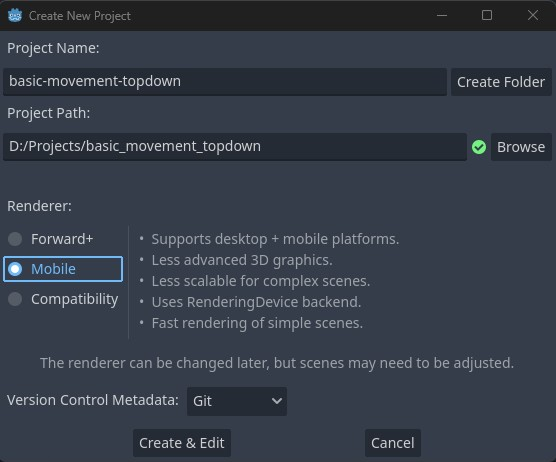  

- Then, we import the sprite for the character [DOWNLOAD](https://raw.githubusercontent.com/jontopielski/Top-Down-Sprite-Tutorial/master/player/PlayerSpriteSheet.png).  

- create a new folder named `Player` and drop the `Player.png` from the downloaded ZIP file into there.  
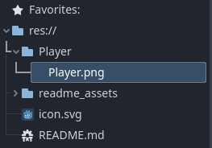

- Now you should have this sprite:


- Inside godot, create `CharacterBody2D`   
    * (**NOTE** in the video tutorial, he uses different node, because `Godot 3.x` used `KinematicBody2D`)


    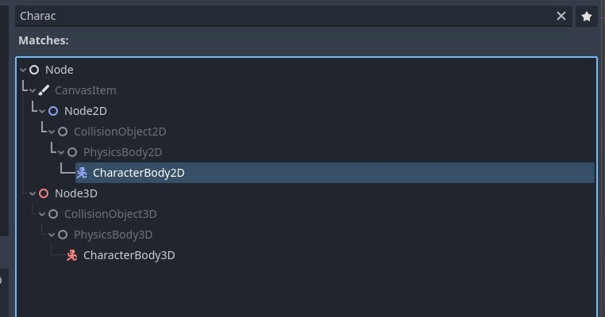

- Add `Sprite` & `CollisionShape2D` to it, and change the name to `Player`  
    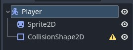
- Open CharacterBody inspector, and change the `Motion Mode` to `Floating`, this will make sure that the character ignores gravity.  
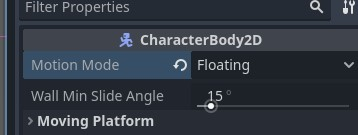
- Add the `Player.png` to the `Sprite` (You can just drag it to there).
- Change `Hframes` to `48`, because this sprite has 48 frames. (`48 Horizontal Frames`)
- Change `Texture > Filter` to `Nearest` to make the sprite actually pixelated.
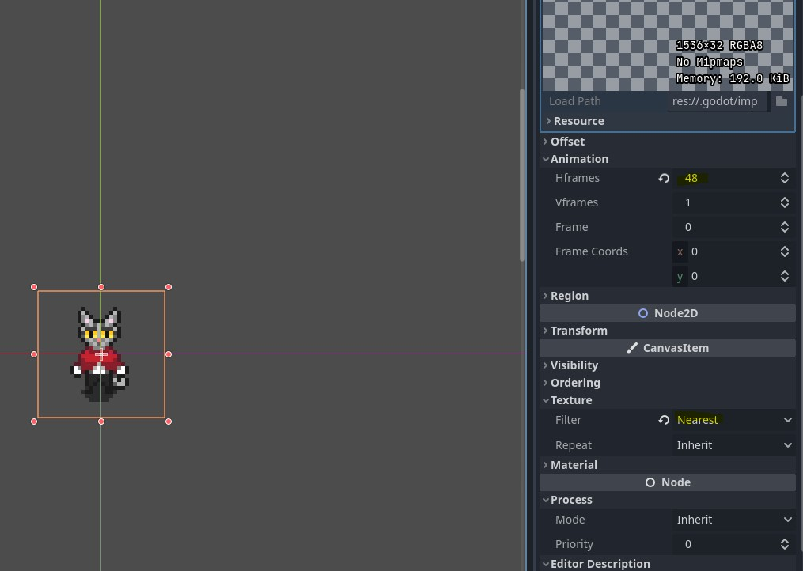
- Add a shape to the `CollisionBody`:  
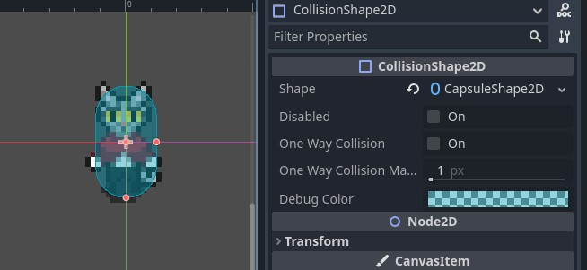
- Incase you didn't, add input maps, for example:
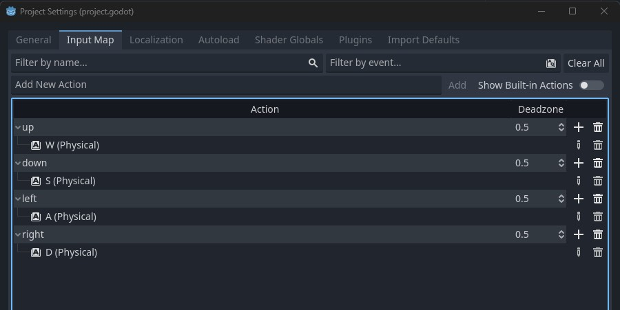

- Add a script to the Player.
`Player.gd`:  
```
extends CharacterBody2D

@export var speed := 80.0

func _physics_process(delta):
	var movement_vector = Input.get_vector("left", "right", "up", "down").normalized()
	velocity = movement_vector * speed
	move_and_slide()
```
- When you have everything setup, you can start moving in the game after you run it, but still no animation.

---
## `Animation Part`
Instead of explaining how to add animation, just use this video at this timestamp -> [Click me](https://youtu.be/Xf2RduncoNU?t=131), watch untill `3:10`  
* **NOTE** - Some of the animations use `flip_h`, which stands for flip horizontally 

By the end of this part, you should have:
- 8 animations.
- Each of them has loop `on`.
- Each of them is `0.8` seconds.
- Each of them ahs `8 frames`.
- Some of them have `flip_h` on.
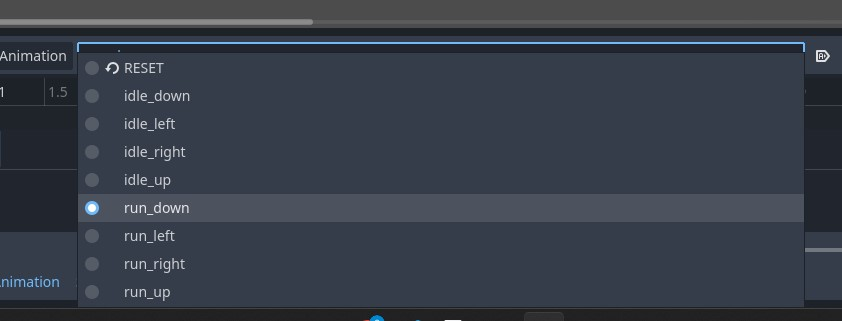

### `AnimationTree`
- Create an animation tree node
- set:
    - `Tree Root` to `AnimationNodeStateMachine`
    - `Anim Player` to `AnimationPlayer`
    - `Active` to `On`  
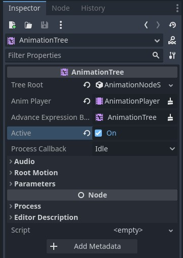
- Create 2 BlendSpace2D, and name them `Idle` & `Run`
- Connect them like in the image below.
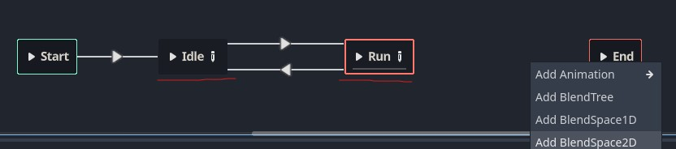
- In order to set the animation tree, you should now watch this video, It will explain in the best way on how to set it - It also explains about the animation tree state machine.
- [Watch 29:00 -> 40:00](https://youtu.be/Luf2Kr5s3BM?t=1745)

- The code from the video, in a bit of a different way (Main difference is some syntax i used, and i used `Run` instead of `Walk`), and normalized the axis:

`Player.gd`
```
extends CharacterBody2D

@export var speed := 80.0
@export var starting_direction := Vector2(0,1)
@onready var animation_tree = $AnimationTree
@onready var state_machine = animation_tree.get("parameters/playback")

func _ready():
	animation_tree.set("parameters/Idle/blend_position",starting_direction)

func _physics_process(delta):
	var movement_vector = Input.get_vector("left", "right", "up", "down")
	update_anim_params(movement_vector)
	velocity = movement_vector.normalized() * speed
	move_and_slide()
	set_animation_state()

func update_anim_params(input:Vector2):
	if input != Vector2.ZERO:
		animation_tree.set("parameters/Run/blend_position",input)
		animation_tree.set("parameters/Idle/blend_position",input)
	
func set_animation_state():
	if velocity != Vector2.ZERO:
		state_machine.travel("Run")
	else:
		state_machine.travel("Idle")
```

- `Code Key notes:` (HL)
    -  `_ready` + `starting_direction` will set the initial position of the Animation Tree.
    - `set_animation_state` will handle the state change of the animations, will use "`Run`" animation if moving (aka vector is not 0,0) else will use animation "`Idle`".

- A bit shorter version of the code (I personally preffer the above.)
```
extends CharacterBody2D

@export var speed := 80.0
@export var starting_direction := Vector2(0,1)
@onready var animation_tree = $AnimationTree
@onready var state_machine = animation_tree.get("parameters/playback")

func _ready():
	animation_tree.set("parameters/Idle/blend_position",starting_direction)

func _physics_process(delta):
	var movement_vector = Input.get_vector("left", "right", "up", "down")
	if movement_vector != Vector2.ZERO:
		animation_tree.set("parameters/Run/blend_position",movement_vector)
		animation_tree.set("parameters/Idle/blend_position",movement_vector)
		state_machine.travel("Run")
	else:
		state_machine.travel("Idle")
				
	velocity = movement_vector.normalized() * speed
	move_and_slide()

```


# `General Key Notes:`
- Y Axis is opposite in Godot, meaning that a positive Y is down.  

- It's important to change the coodinates marked in yellow in the image from `1` to `1.1`, and from `-1` to `-1.1`, this will prioritize the up and down, over left and right, during movement, so when going diagonally it will look legit.  

- Make sure that this connect node is set as in the image follows it:
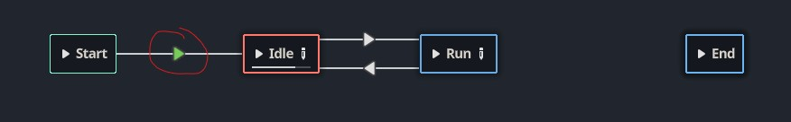
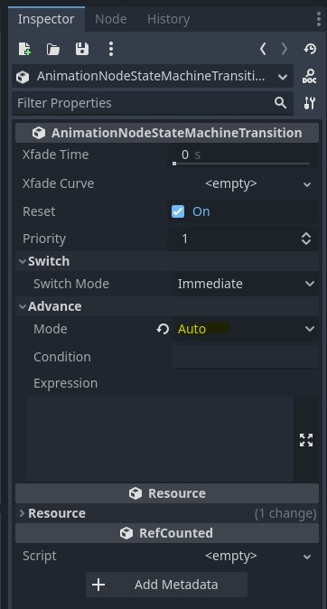  

- Make sure all of the animations blend mods are set to `Descrete` (It's for pixel games), by picking the dots:
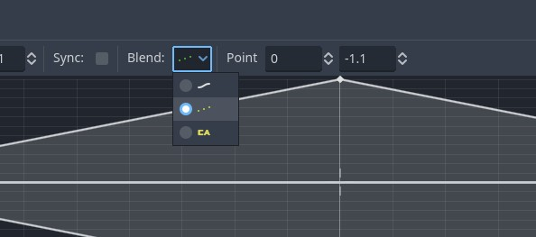